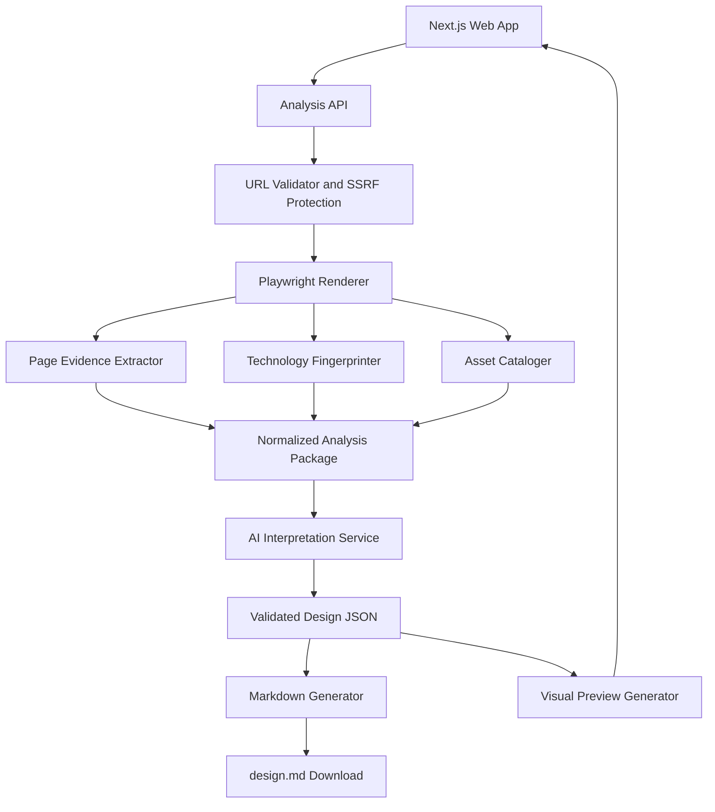

# design.md Product Design

## 1. Product Summary

`design.md` is an inspiration-to-implementation tool for developers and designers. A user submits a public website URL, optionally adds screenshots, and receives a downloadable Markdown design specification plus a visual preview.

The product helps users understand and recreate a visual style in an original project. It is not positioned as a website cloning tool and should not present copied content, assets, or source structure as the intended output.

## 2. Target Users

### Developers

Developers use the product to understand how to recreate a visual language when they do not know how to build a similar interface themselves.

### Designers

Designers use the product to reverse-engineer and document design systems, visual patterns, components, and implementation-relevant observations.

## 3. MVP Scope

The first version should:

- Accept one public website URL.
- Analyze one page.
- Support optional screenshot uploads as a fallback or supplement.
- Extract visual styles, layout, page structure, responsive behavior, accessibility observations, assets, and technology signals.
- Generate one downloadable `design.md` file.
- Generate a visual preview for validating the analysis.
- Separate observed facts from inferred design-system recommendations.
- Include confidence levels and evidence for major claims.
- Show technology findings as verified, likely, possible, or unknown.
- Provide asset previews and original URLs rather than silently redistributing third-party assets.

The MVP should not include:

- Full-site crawling.
- Generated production code.
- Authentication, billing, or saved projects.
- Automatic redistribution of third-party assets.
- Exact site cloning.

## 4. User Flow

1. The user enters a public website URL.
2. The system validates the URL and blocks unsafe destinations.
3. The system renders one page in a controlled browser.
4. The system captures desktop and mobile evidence.
5. The system extracts visual, structural, asset, accessibility, and technology evidence.
6. The AI interprets the normalized evidence.
7. The system validates the AI response against a schema.
8. The system creates a visual preview.
9. The user downloads `design.md` directly.

## 5. Output Contract

The generated file should contain these sections:

```md
# Design Analysis

## Source
## Observed Page Structure
## Observed Visual System
## Technology Fingerprint
## Inferred Design System
## Components and Patterns
## Responsive Behavior
## Accessibility Observations
## Asset Catalog
## Confidence and Evidence
## Implementation Guidance
```

The three most important layers are:

- **Observed Source**: measured or directly detected facts.
- **Inferred Design System**: normalized tokens and reusable patterns derived from evidence.
- **Implementation Guidance**: recommendations for creating an original project with a similar visual language.

## 6. Technology Fingerprinting

Technology detection is evidence-based fingerprinting, not guaranteed dependency identification.

### Direct evidence

Inspect publicly available source, source maps, package metadata, imports, lockfiles, CSS configuration, script names, and framework markers when available.

### Runtime evidence

Inspect loaded scripts, network requests, DOM attributes, CSS classes, generated styles, accessibility behavior, SVG signatures, and framework-specific markers.

### Visual and behavioral evidence

Compare component structure, interaction states, focus behavior, animation, spacing, and icon geometry against known library patterns.

Each finding must include:

```ts
type TechnologyFinding = {
  name: string;
  status: "verified" | "likely" | "possible" | "unknown";
  confidence: "high" | "medium" | "low";
  evidence: string[];
  recommendation?: string;
};
```

The system must not claim that a site uses shadcn/ui based only on visual similarity. shadcn/ui components are commonly copied into application source and may leave no runtime identifier. The output may instead recommend shadcn/ui, Radix, Tailwind, or another equivalent stack for reproduction.

## 7. Asset Catalog

The asset catalog should identify:

- Images
- Logos
- SVG icons
- Fonts
- Background images
- Favicons
- Social preview images

Each asset should include:

- Original URL
- Preview when possible
- Dimensions
- File format
- Page location
- Asset type
- Whether it appears decorative or content-specific
- Source or licensing context when available

The default behavior is to show previews and original links. Downloading or redistributing third-party assets is not the default behavior.

## 8. System Architecture



### URL Validator

The validator must:

- Accept only HTTP and HTTPS URLs.
- Block localhost, loopback, private IP ranges, and cloud metadata endpoints.
- Limit redirects.
- Apply request timeouts and response-size limits.
- Restrict unsafe protocols.
- Rate-limit analysis requests.

### Playwright Renderer

The renderer loads the page in a controlled Chromium browser and captures:

- Desktop screenshots.
- Mobile screenshots.
- Full-page screenshots.
- DOM structure.
- Computed styles.
- Loaded fonts.
- Images and SVGs.
- Interactive elements.
- Responsive behavior.
- Accessibility information.

### Evidence Extractor

The extractor converts browser data into normalized facts rather than asking the AI to infer directly from raw HTML.

```ts
type PageEvidence = {
  sourceUrl: string;
  screenshots: ScreenshotEvidence[];
  structure: StructureEvidence;
  colors: ColorEvidence[];
  typography: TypographyEvidence[];
  spacing: SpacingEvidence[];
  layout: LayoutEvidence[];
  components: ComponentEvidence[];
  responsive: ResponsiveEvidence[];
  accessibility: AccessibilityEvidence[];
};
```

### AI Interpretation Service

The AI receives the normalized evidence package, screenshots, asset metadata, and technology findings. It returns structured JSON containing observed facts, inferred tokens, reusable patterns, recommendations, confidence levels, and evidence references.

The AI must not receive an uncontrolled, enormous raw HTML document as its primary input.

### Document Generator

The document generator converts validated JSON into a predictable Markdown template. Model output must be schema-validated before rendering.

### Visual Preview

The preview should display:

- Observed versus inferred information.
- Color swatches.
- Typography samples.
- Spacing scale.
- Component examples.
- Technology findings.
- Asset thumbnails.
- Responsive notes.

The preview exists to help users validate the analysis. The downloadable `design.md` is the primary artifact.

## 9. Recommended Technology Stack

- Next.js and TypeScript for the web app and API.
- Playwright and Chromium for browser rendering.
- Tailwind CSS for the product interface.
- Zod for validating extraction and AI schemas.
- A multimodal AI model for visual and structured interpretation.
- PostgreSQL later for saved projects and users.
- S3-compatible storage later for screenshots and generated files.
- Redis and BullMQ later for queued, long-running analysis jobs.

The MVP should avoid Postgres, Redis, object storage, authentication, and billing until the analysis pipeline is proven.

## 10. Suggested Project Structure

```text
app/
  page.tsx
  api/
    analyze/
      route.ts

src/
  analyzer/
    browser.ts
    evidence-extractor.ts
    technology-fingerprinter.ts
    asset-cataloger.ts
    url-validator.ts
  ai/
    analyze-design.ts
    prompts.ts
    schemas.ts
  document/
    render-design-markdown.ts
    template.ts
  preview/
    preview-model.ts
  types/
    analysis.ts

scripts/
  analyze-url.ts

tests/
  analyzer/
  ai/
  document/
```

## 11. Build Plan

### Phase 1: Define the contracts

Create TypeScript and Zod schemas for page evidence, technology findings, asset entries, AI output, and the final document model.

### Phase 2: Build the analysis script

Create:

```bash
npm run analyze -- https://example.com
```

The script should initially produce:

```text
output/
  page-evidence.json
  technology-findings.json
  assets.json
  desktop.png
  mobile.png
```

### Phase 3: Implement extraction

Add URL validation, Playwright rendering, computed style extraction, DOM structure extraction, screenshots, asset discovery, and technology fingerprinting.

Test against at least three unrelated websites.

### Phase 4: Add AI interpretation

Send the normalized evidence package to the model and receive validated JSON. Verify that the AI separates observed and inferred information, includes confidence levels, avoids unsupported library claims, and produces useful original implementation guidance.

### Phase 5: Generate Markdown

Render validated JSON into the fixed `design.md` structure.

### Phase 6: Build the web interface

Add URL input, optional screenshot upload, analysis progress, errors, visual preview, and direct download.

### Phase 7: Add production infrastructure

Only after the core pipeline works, add background jobs, PostgreSQL, object storage, authentication, rate limits, usage limits, and saved analyses.

## 12. First Milestone

The first milestone is a reliable command-line pipeline:

```bash
npm run analyze -- https://example.com
```

It should extract:

1. Desktop and mobile screenshots.
2. Colors.
3. Typography.
4. Major layout sections.
5. Assets and original URLs.
6. Technology fingerprints.
7. Confidence and evidence data.

Only after this works across several sites should the web interface be built around it. The extraction and document quality are the product; the interface is the container.

## 13. Success Criteria

The MVP is useful when an experienced developer can use only the generated `design.md` to create an original page with a credible version of the source page's visual language without repeatedly inspecting the original website.

The system should be judged on:

- Accuracy of measured evidence.
- Honesty of technology identification.
- Usefulness of component and stack recommendations.
- Asset discoverability.
- Clarity between observation and inference.
- Quality of the generated implementation guidance.
