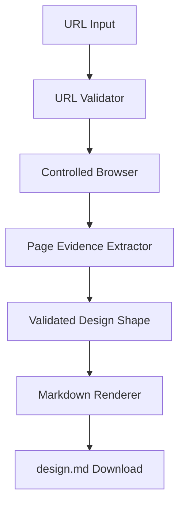

# design.md Product Architecture

## 1. Product

`design.md` accepts a public website URL and extracts the page's visual
design shape into a structured design specification.

The output describes the source page's visual language so a developer can
recreate a similar original interface without repeatedly inspecting the
source page. The product does not clone the page or generate production code.

## 2. MVP Scope

The first version should:

- Accept one public HTTP or HTTPS URL.
- Analyze one page.
- Render the page at desktop and mobile viewports.
- Extract measurable visual and structural properties:
  - Page sections and hierarchy.
  - Layout containers, columns, grids, and alignment.
  - Colors and contrast relationships.
  - Typography families, sizes, weights, and line heights.
  - Spacing and sizing patterns.
  - Repeated component shapes and states.
  - Responsive layout changes.
  - Images, icons, and fonts used by the page.
- Produce validated structured JSON.
- Render the JSON as a downloadable `design.md` file.

The MVP should not include:

- Full-site crawling.
- User accounts, saved projects, billing, or usage limits.
- Production code generation.
- Editable design-system management.
- Automatic copying or redistribution of source assets.
- Technology or dependency identification unless it directly explains an
  extracted visual property.

## 3. User Flow

1. The user enters a public website URL.
2. The system validates the URL and blocks unsafe destinations.
3. A controlled browser renders the page at fixed desktop and mobile
   viewports.
4. The extractor captures screenshots and browser measurements.
5. The extractor converts those measurements into a normalized design shape.
6. The system validates the design shape.
7. The system renders the validated result as `design.md`.
8. The user downloads the design specification.

## 4. Output Contract

The generated document should contain:

```md
# Design Shape

## Source
## Page Structure
## Layout
## Color System
## Typography
## Spacing and Sizing
## Components and Patterns
## Responsive Behavior
## Assets
## Evidence
```

The output must distinguish:

- **Observed:** values measured or directly detected from the rendered page.
- **Inferred:** reusable patterns derived from multiple observations.

Every inferred value must reference the observations that support it.

## 5. System Architecture



### URL Validator

The validator must:

- Accept only HTTP and HTTPS URLs.
- Reject localhost, loopback, private IP ranges, and cloud metadata
  endpoints.
- Limit redirects.
- Apply request timeouts and response-size limits.

### Controlled Browser

The browser renders the page in Chromium at fixed viewports and captures:

- Desktop and mobile screenshots.
- DOM structure and semantic regions.
- Computed styles.
- Loaded fonts.
- Images and SVGs.
- Interactive element geometry.
- Responsive behavior.

Raw HTML is an input to extraction, not part of the generated design shape.

### Page Evidence Extractor

The extractor converts browser data into normalized, revision-scoped facts.
Evidence is immutable for a page render and can support either an observed
field or an inferred design pattern.

The TypeScript and Zod contract lives in `src/types/evidence.ts`. It should
validate:

- The source URL and capture timestamp.
- Evidence source and artifact metadata.
- Desktop/mobile screenshot metadata.
- Observed versus inferred status.
- Confidence levels.
- Evidence references used by inferred fields.
- Consistent identifiers within one page render.

### Design Shape

The validated design shape should contain:

- Source metadata.
- Page structure.
- Layout measurements.
- Color observations and inferred palette roles.
- Typography observations and inferred type scale.
- Spacing observations and inferred spacing scale.
- Repeated component patterns.
- Responsive differences.
- Relevant assets and their original URLs.
- Evidence references and confidence.

## 6. Recommended Technology

- TypeScript for application and domain types.
- Next.js for the web application and API.
- Playwright and Chromium for controlled rendering.
- Zod for evidence and output validation.
- A Markdown renderer for the downloadable specification.

The MVP should use local or ephemeral output storage. Persistent databases,
object storage, background queues, authentication, and billing are
out of scope until extraction quality is proven.

## 7. Suggested Project Structure

```text
app/
  page.tsx
  api/
    analyze/
      route.ts

src/
  analyzer/
    browser.ts
    evidence-extractor.ts
    url-validator.ts
  document/
    render-design-markdown.ts
    template.ts
  types/
    analysis.ts
    evidence.ts

scripts/
  analyze-url.ts

tests/
  analyzer/
  document/
```

## 8. Build Plan

### Phase 1: Define contracts

Create TypeScript and Zod schemas for page evidence and the final design
shape.

### Phase 2: Build the URL pipeline

Create:

```bash
npm run analyze -- https://example.com
```

The command should produce:

```text
output/
  page-evidence.json
  design-shape.json
  design.md
  desktop.png
  mobile.png
```

### Phase 3: Implement extraction

Add URL validation, browser rendering, screenshot capture, DOM structure
extraction, computed-style extraction, responsive comparison, and asset
discovery.

### Phase 4: Render the specification

Validate the design shape and render it into the fixed `design.md` structure.

### Phase 5: Add the web interface

Add URL input, analysis progress, errors, preview, and direct download.

## 9. First Milestone

The first milestone is a reliable command-line pipeline that accepts a URL
and extracts:

1. Desktop and mobile screenshots.
2. Major page sections and layout relationships.
3. Colors and typography.
4. Spacing and sizing patterns.
5. Repeated component shapes.
6. Responsive differences.
7. Relevant asset URLs.
8. Confidence and evidence references.

## 10. Success Criteria

The MVP succeeds when an experienced developer can use only the generated
`design.md` to create an original page with a credible version of the source
page's visual language.

Evaluate it on:

- Accuracy of measured visual values.
- Correctness of page hierarchy and layout relationships.
- Usefulness of inferred design tokens and patterns.
- Clarity between observation and inference.
- Fidelity of responsive behavior.
- Discoverability of relevant assets.
